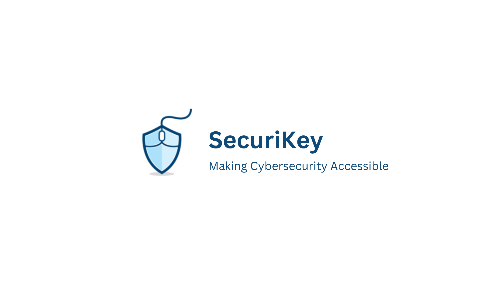

## Security Made Easy 

:white_check_mark: Windows compatible 

:white_check_mark: Easy to Use

:white_check_mark: Plug and Play

### Check out [our website](https://www.securikey.io/) to learn more 

:mortar_board: University of California Berkeley MICS 2023 Fall Capstone Project

## Our Team

**Yan Han** - Project Manager.

**Mark Mengelt** - Lead developer. Working as a full-stack developer in Vulnerability & Attack Surface Management at Boeing.

**Jeremy Colvin** - Developer. Currently employed as a Technical Marking Engineer.

**Jason Young** - Developer + architect. Working as a med tech leader developing disruptive technologies.

**Anastasia Sizensky** - Website designer, vulnerability solver. Currently employed as a Cloud Security Engineer at SAP.

